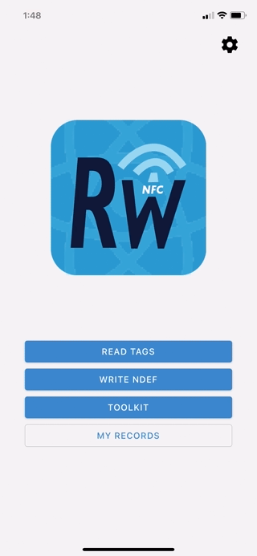
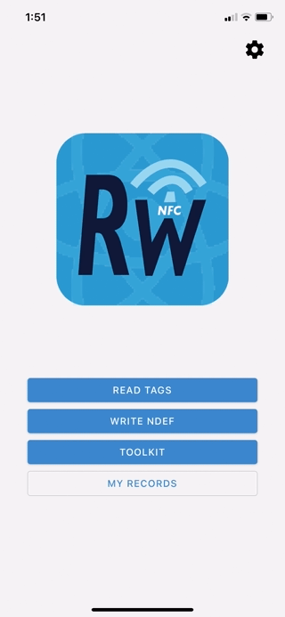

  

  <h2 align="center">NFC Open ReWriter</h2>

---

 

  

  

 

  This open source React Native NFC app allows read & write to NFC tags

<table align="center">
<tr>
  <td>
      
      <h3 align="center">Read</h3>
  </td>
  <td>
      
      <h3 align="center">Write</h3>
  </td>
</tr>
</table>

  And much more! 

<table align="center">
<tr>
  <td>
      
      <h3 align="center">Custom commands</h3>
  </td>
  <td>
      
      <h3 align="center">Save Your Own Records</h3>
  </td>
</tr>
</table>

The NFC library is powered by <a href="https://github.com/facebook/react-native">react-native</a> as well as <a href="https://github.com/whitedogg13/react-native-nfc-manager">react-native-nfc-manager</a>

## Features

- Read NFC tags
  - uid
  - NFC technology
  - NDEF
- Write NDEF
  - RTD_URI
    - url, email, sms, tel, or custom scheme
  - RTD_TEXT
  - WIFI SIMPLE RECORD
- Toolkits
  - NfcA
    - Custom transceive
    - Erase all
    - Format to NDEF
  - IsoDep
    - Custom APDU (mostly Android)
- Save your own records

## Made by

<table>
<tr>
  <td>
      
      <h3 align="center">Revteltech</h3>
  </td>
  <td>
      
      <h3 align="center">Washow</h3>
  </td>
</tr>
</table>
